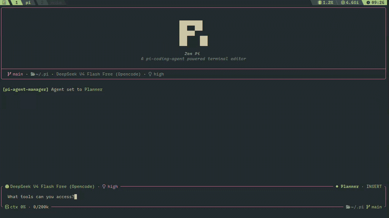

# pi-agent-manager

A [pi](https://github.com/earendil-works/pi-coding-agent) extension for agent-mode switching with OpenCode-style
permission guards. Each agent is a persona + a ruleset that resolves every tool call to **allow**, **ask**, or **deny**.

- `deny` → tool physically stripped (model never sees it)
- `ask` → confirmation dialog with once / always / reject outcomes
- `allow` → passes through



## How it works

A **Ruleset** is an ordered list of `{ permission, pattern, action }` rules — last-matching-rule-wins.
The same rule engine powers both physical tool stripping (`deny` + `"*"`) and the interactive ask gate.

On startup the extension snapshots all registered tools and pushes only the allowed ones via `pi.setActiveTools()`.
Before every turn the active agent's persona is injected into the system prompt. On every tool call the extension
evaluates the tool against the current ruleset. `ask` triggers a confirmation; "always" appends a runtime rule to
the session ruleset so it won't prompt again.

## Built-in agents

| Agent    | Rules                                                                  | Description                          |
| -------- | ---------------------------------------------------------------------- | ------------------------------------ |
| planner  | read/grep/glob/list + web + subagent allowed; edit/bash denied         | Analysis-first, never writes or runs |
| builder  | everything allowed; `rm`, `sudo`, `chmod`, `chown` gated behind ask    | Execution-oriented, destructive ops protected |

## Install

```bash
pi install npm:@leo-alvarenga/pi-agent-manager
# or local:
pi install ./path/to/pi-agent-manager
```

Restart pi or run `/reload`.

## Usage

| Command          | Action                                                                         |
| ---------------- | ------------------------------------------------------------------------------ |
| `/agents`        | Interactive picker (arrows, type-to-filter, enter/esc)                         |
| `/agents <name>` | Switch directly (tab-complete)                                                 |
| `/agents_help`   | Agent list, rules summary, keybindings, help                                   |
| `/agent_guard`   | Toggle XML permission-envelope injection (`on` / `off` / no args = toggle)         |

An agent switch applies to the next interaction; the last agent is restored on restart.

## Keybindings

Configure in `~/.pi/agent/keybindings.json`:

```json
{
  "piAgentManager.next": "shift+tab",
  "piAgentManager.previous": "ctrl+shift+alt+p",
  "piAgentManager.picker": "ctrl+shift+alt+a"
}
```

Run `/reload` after editing.

## Permission model

The permission engine evaluates `{ permission, pattern }` pairs against one or more rulesets.
**Last matching rule wins.** If no rule matches, the default is `ask` (safe by default).

### Permission keys (tool families)

| Key         | Pi tools mapped                                        |
| ----------- | ------------------------------------------------------ |
| `read`      | `read`                                                 |
| `grep`      | `grep`                                                 |
| `glob`      | `find`                                                 |
| `list`      | `ls`                                                   |
| `edit`      | `write`, `edit`, `delete_file`                         |
| `bash`      | `bash`, `shell`, `run`, `exec`                         |
| `websearch` | `web_search`, `source_check`, `get_search_content`     |
| `webfetch`  | `fetch_content`                                        |
| `task`      | `subagent`, `subagent_wait`, `subagent_supervisor`, `intercom` |
| `question`  | `questionnaire`, `ask_user_question`                   |

Custom/MCP tools not listed above use their own name as the permission key.

### Actions

| Action  | Meaning                                                  |
| ------- | -------------------------------------------------------- |
| `allow` | Tool runs without prompting                              |
| `ask`   | Confirmation dialog (once / always / reject)             |
| `deny`  | Tool physically disabled — model never sees it           |

## Adding agents

Drop `.md` files with YAML frontmatter into `~/.pi/agent/agents/`:

```markdown
---
name: reviewer
description: Reviews code for quality and potential issues
permissions:
  "*": deny
  read: allow
  grep: allow
  glob: allow
  list: allow
  websearch: allow
icon: ★
color: success
---

You are a Code Reviewer: focus on security, performance, and maintainability.
Read freely and suggest improvements, but never edit files or run commands.
```

### Frontmatter fields

| Field         | Required | Description                                                         |
| ------------- | -------- | ------------------------------------------------------------------- |
| `name`        | no*      | Agent name (unique). Defaults to file name                          |
| `description` | yes      | Shown in picker, completions, help                                  |
| `permissions` | yes      | Ruleset object, legacy array, or preset string (see below)          |
| `type`        | no       | `primary` (default) or `subagent`                                   |
| `icon`        | no       | Single-char or short icon string displayed before the name           |
| `color`       | no       | Theme color: `accent`, `success`, `warning`, `error`, `info`, `dim` |
| `hidden`      | no       | `true` hides from picker and shortcut cycling                       |
| `steps`       | no       | Max tool-call iterations before forced summary                      |
| `prompt`      | no       | Body of the .md file becomes the prompt if not set in frontmatter   |

\* Falls back to the markdown file name (without `.md`).

### Permissions formats

**1. Preset string** — shorthand for common profiles:

```yaml
permissions: plan    # read + web + subagent; edit/bash denied
permissions: build   # all allowed; destructive bash gated
permissions: read    # inspection tools only
```

**2. Legacy array** (auto-migrated to ruleset):

```yaml
permissions: [read, web, ask]
```

**3. Full ruleset object** — OpenCode-compatible:

```yaml
permissions:
  "*": deny
  read: allow
  grep: allow
  glob: allow
  list: allow
  websearch: allow
  bash:
    "*": deny
    "npm test*": allow
    "npm run build*": allow
```

Rules are evaluated last-to-first within the object. Put the catch-all `"*"` first, then override with more
specific rules below.

## File hierarchy

```
src/
  index.ts                  Extension entry point (commands, hooks, wiring)
  constants.ts              Shared string constants (keys, tags, defaults)
  agent/
    types.ts                AgentConfig, AgentState, AgentType
    builtin.ts              BUILT_IN_AGENTS, DEFAULT_AGENT
    manager.ts              AgentManager — state machine, tool guard, session rules
    config.ts               User-agent loader (.md files), keybinding loader
  permission/
    types.ts                Action, Rule, Ruleset, ToolToPermission
    evaluate.ts             evaluate(), disabled(), merge()
    wildcard.ts             Wildcard.match()
    mapping.ts              TOOL_TO_PERMISSION constant, extractPattern()
    presets.ts              PERMISSION_PRESETS, fromLegacyPermissions()
  cli/
    picker.ts               Interactive TUI agent picker
    help.ts                 Help text, permission badges, validators
    logger.ts               Logger wrapper around pi's UI notify
```
