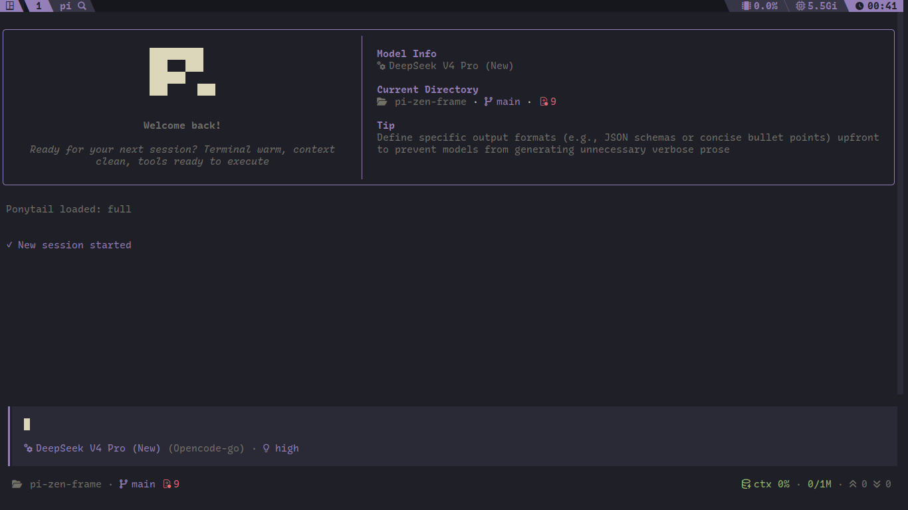

# pi-zen-frame

A [pi-coding-agent](https://github.com/earendil-works/pi) extension that gives the TUI editor a simple yet polished look and feel.

- **Frame** — a box (`╭ ╮ ╰ ╯ │ ─`) with live status segments embedded in the top/bottom border.
- **Header** — an optional Claude-welcome-style top box: logo (left, 40%) + model/provider and cwd/git info (right, 60%, split in two halves).
- **Working messages** — randomized messages in pi's built-in working loader, swapped on a configurable interval (on by default).
- **Theme native** — every color is a pi `ThemeColor`, so it follows your active pi theme.



## Install

It's distributed as a pi package. Add it to `settings.json` → `packages`, e.g. install from
a local checkout or registry:

```jsonc
// ~/.pi/agent/settings.json
{
  "packages": ["npm:@leo-alvarenga/pi-zen-frame", "path/to/pi-zen-frame"],
}
```

Restart pi (or `/reload`).

## Config

zen editor reads `~/.pi/agent/pi-zen-frame.json`. All keys are optional; defaults are shown.

```jsonc
{
  // Accent used by segments/frame when a more specific color isn't set.
  "accentColor": "accent",

  // Master mute: every segment except agent-mode renders muted.
  // Toggle at runtime with /zen_mode or the piZenFrame.zenMode keybinding.
  "zenMode": true,

  "header": {
    "enable": true,
    "logo": [" ", "██████████", "███   ███ ", "██████    ", ...],
    "heading": "Zen Pi",
    "subheading": "A pi-coding-agent powered terminal editor",
    "logoColor": "text",
    "accentColor": "customMessageLabel"
  },

  "frame": {
    "enable": true,
    // Below this terminal width the box is skipped (plain editor).
    "minWidth": 20,

    // Blank lines inside the box (padding) / outside it (margin).
    "paddingTop": 1,
    "paddingBottom": 1,
    "paddingX": 1,
    "marginTop": 0,
    "marginBottom": 0,

    // Border segments on/off.
    "showCwd": true,
    "showModel": true,
    "showContext": true,
    "showThinking": true,
    "showSpinner": false,
    "showAgentMode": true,

    // Defaults to accentColor, then "border"; Can also be set to "agentMode" to match the current agent's color
    "borderColor": "border",

    // Glyph shown before the editor content. Default "❯".
    "prefix": "❯",

    // Prefix color source: "agentMode" (current agent), "frameBorder" (frame
    // border color), or any ThemeColor. Default: text color.
    "prefixColor": "muted",

    // Override the Nerd-Font glyphs (folder, model, context, thinking,
    // gitDirty, gitBranch).
    "icons": {},

    // Per-segment fg overrides (any subset; supersede the built-in colors,
    // e.g. the ctx traffic-light). Keys: model, thinking, context, cwd,
    // agentMode. agentMode only applies when zenMode is off and no agent
    // color is set.
    "colors": { "model": "accent", "cwd": "accent" }
  },

  // Randomized messages shown in pi's built-in working loader (the
  // "Working..." line while streaming). A new random message is picked
  // every `intervalMs`; no repeats until the pool is exhausted. Default on.
  "workingMessage": {
    "enable": true,
    "intervalMs": 3000,
    "messages": ["Exploring the seas", "Tinkering with strange objects", "..."]
  }
}
```

## Commands & keybindings

- `/zen_mode` — toggle zen mode (all segments muted except agent-mode).
- Toggle keybinding: `piZenFrame.zenMode`, default `ctrl+shift+z`. Rebind or
  disable it in `~/.pi/agent/keybindings.json`:

```jsonc
// ~/.pi/agent/keybindings.json
{
  "piZenFrame.zenMode": "ctrl+shift+z", // or [] to disable; /zen_mode still works
}
```

After editing `keybindings.json`, run `/reload` to apply.

## The frame

The editor's content is boxed with rounded corner glyphs and two live status rails painted into the top and bottom borders.

### Top border (left)

- **model** — active model name + provider, accented.
- **reasoning** — current thinking level, tinted with pi's own thinking token (`thinkingLow` … `thinkingXhigh`).
- **spinner** — streaming phase (`thinking` / `outputting` / `toolcall` / `exec`), replaces the left slot while active.

### Top border (right)

- **ctx** — context window usage: percentage + `used/window` tokens. Color winds traffic light (green → warning at ≥50% → red at ≥80%).

### Bottom border (left)

- **agent mode** — current pi-agent-manager agent as a colored pill (optional, no hard dependency).

### Bottom border (right)

- **cwd** — working directory (shortened) + git branch and dirty file count.

All of these are colored with pi `ThemeColor`s, so they follow kanagawa, dark, etc.

## Source layout

```
extensions/
  index.ts            entry: config, events, editor install
  config/             types, constants, settings loading/normalization
  components/         header, frame, segments, registry (one file per segment)
  editor/             FrameEditor (frame + spinner rendering)
  utils/              agent-mode, git, path, string helpers
```
